# Work Suite

A desktop productivity suite built with Python and tkinter. Five modules sharing a single SQLite database — tracks overtime hours, payslips, anime episodes, and manga chapters.

4,700+ lines of Python. 8 database tables. MyAnimeList API integration. Two themes. Auto-migration from legacy data.

---

## Launcher

The hub that launches all three apps. Includes a database schema guide and a theme toggle (light / gray).

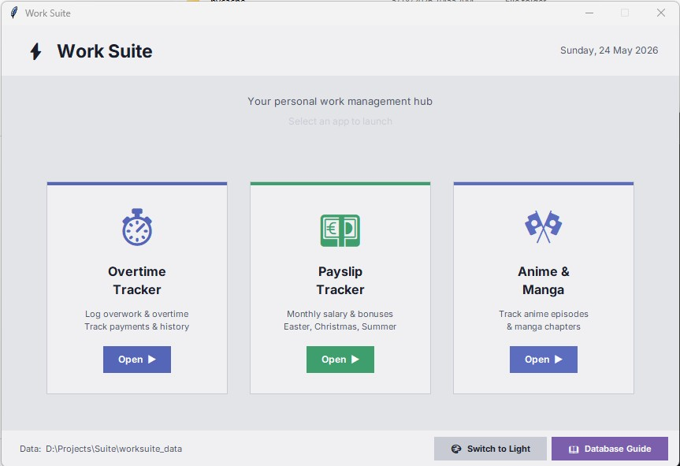

---

## Overtime Tracker

Log work hours with automatic split calculation — first hour at x1.2 (overwork), remaining at x1.4 (overtime). Custom calendar date picker, filterable history with paid/unpaid tracking, bulk operations, and CSV export.

| Dashboard | Log Hours |
|-----------|-----------|
| 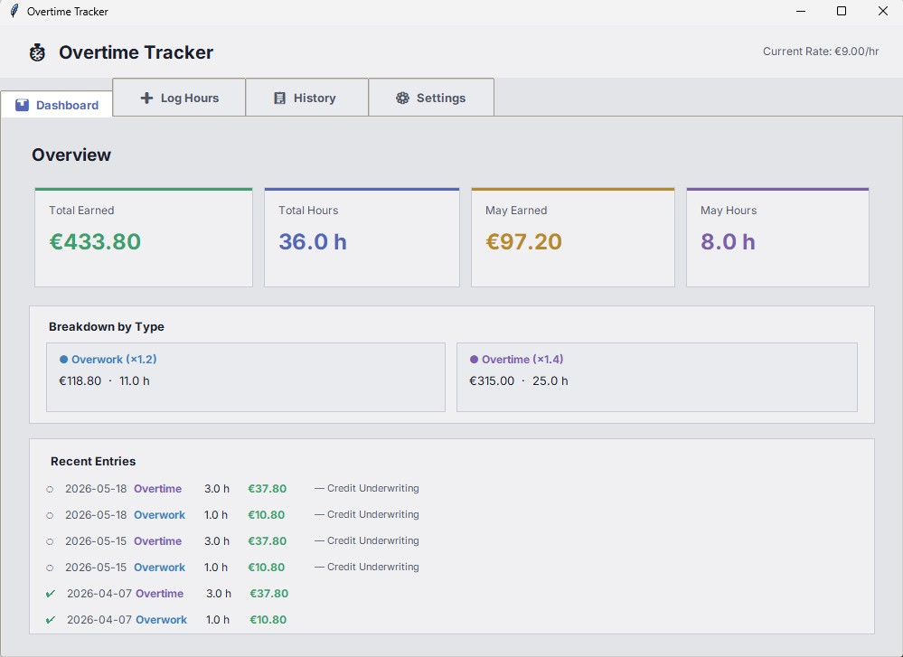 | 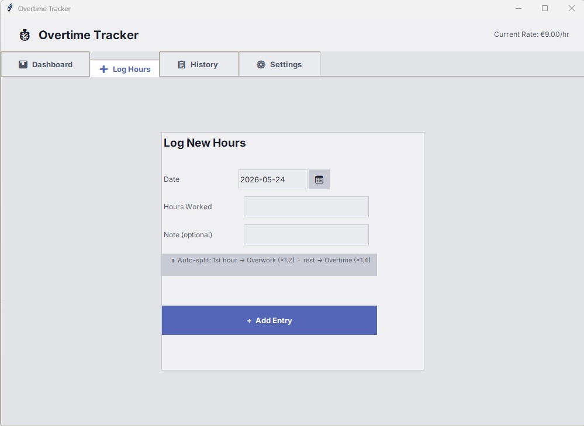 |

| History | Settings |
|---------|----------|
| 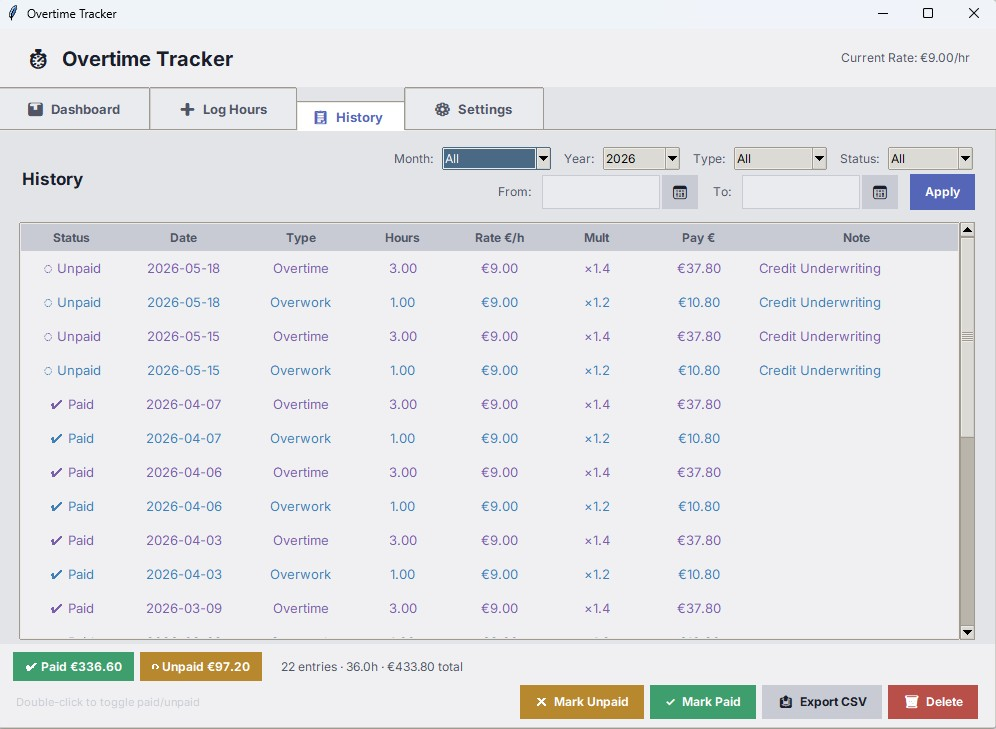 | 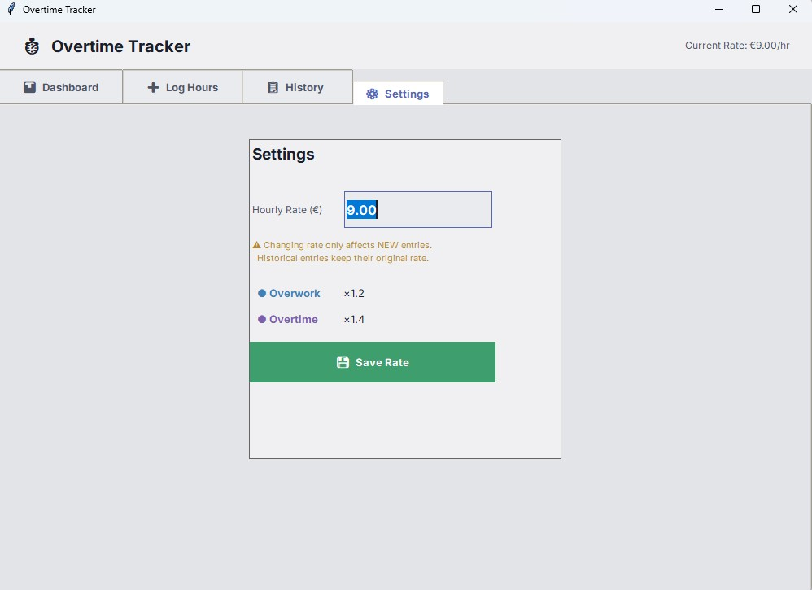 |

---

## Payslip Tracker

Track monthly salary alongside Easter, Christmas, and Summer bonuses. 12-month breakdown table, duplicate detection, and filtered history with CSV export.

| Dashboard | Log Payslip | History |
|-----------|-------------|---------|
| 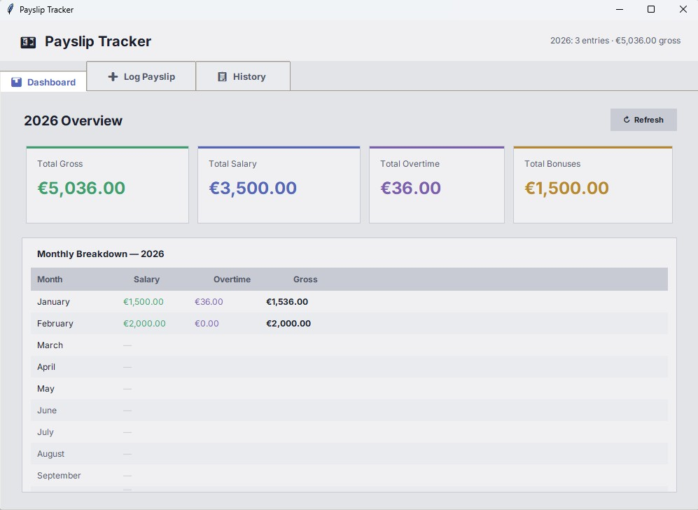 | 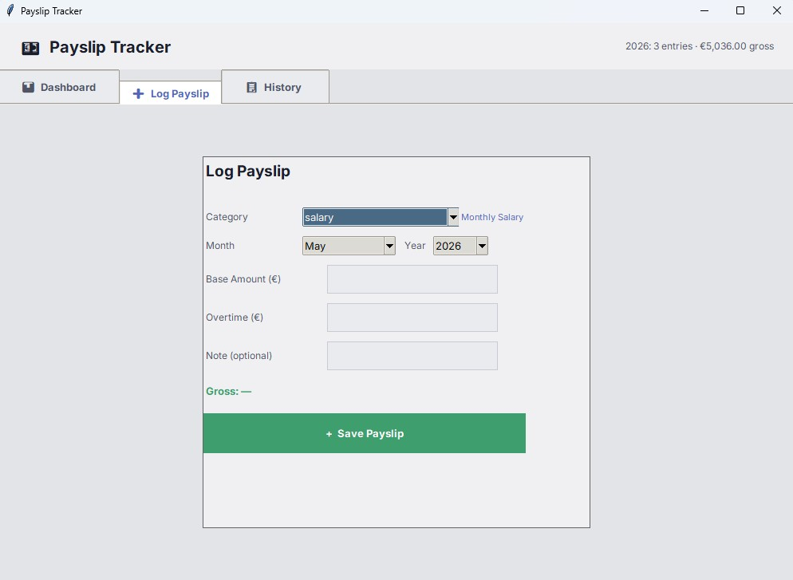 | 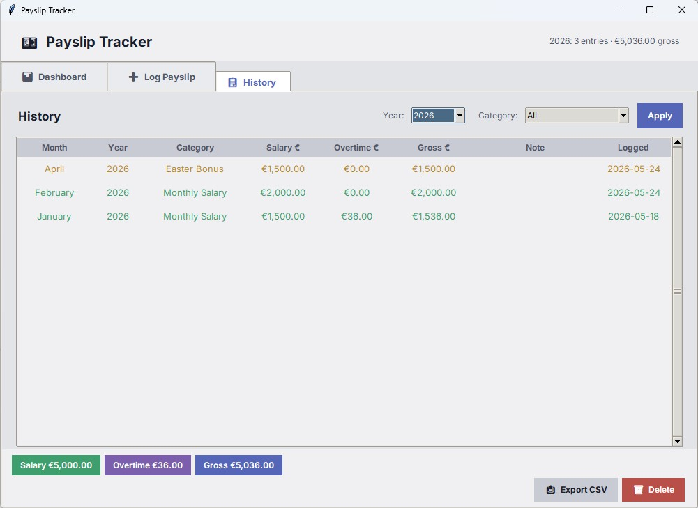 |

---

## Anime & Manga Tracker

The largest module at 2,600+ lines. Franchise-based tracking where one entry holds multiple seasons, movies, and OVAs, each with individual episode progress.

**Anime Stats and Library**

| Stats Dashboard | Library Grid |
|-----------------|-------------|
| 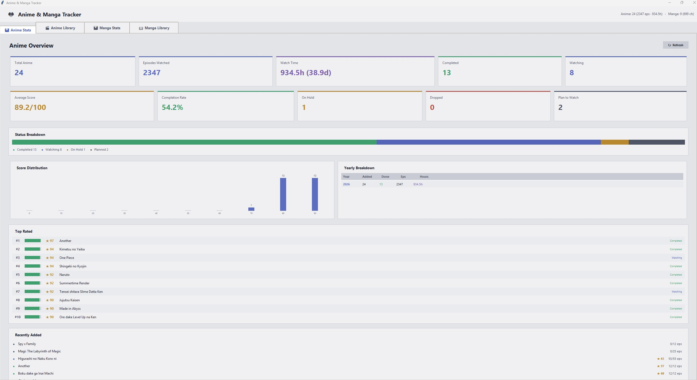 | 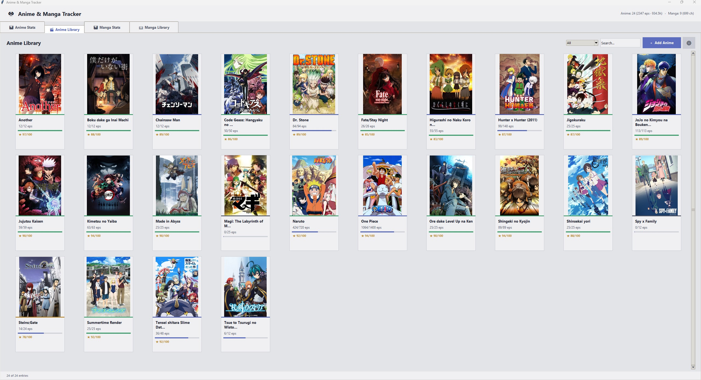 |

**Manga Stats and Library**

| Stats Dashboard | Library Grid |
|-----------------|-------------|
| 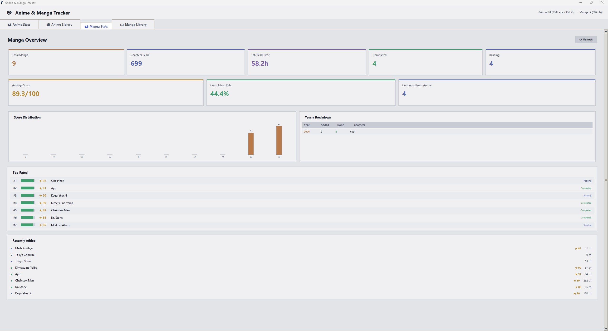 | 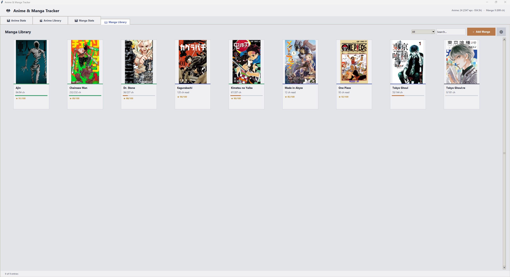 |

Key features:

- **MyAnimeList API search** — search directly from the app, auto-fill episode counts, durations, and cover art
- **Scrollable search popups** — browse up to 25 API results and add seasons or movies with one click
- **Smart manga progress** — continuation mode calculates progress relative to a starting chapter
- **Editable titles** — double-click to rename entries, dedicated rename button for seasons
- **Image caching** — covers loaded once and cached in memory for smooth scrolling
- **Responsive grid** — columns adjust automatically to window width, configurable gap
- **Dashboard** — stats cards, status breakdown, score distribution, yearly table, top rated list

---

## Database Architecture

All apps share a single SQLite database (`worksuite_data/worksuite.db`) with cascading foreign keys:

```
anime
  |-- anime_seasons -- episode_progress (watched flag + filler flag per episode)
  |-- anime_extras (movies and OVAs)

manga (standalone with chapter continuation tracking)

overtime_entries + overtime_settings
payslip_entries (unique constraint on year + month + category)
```

8 tables, 5 indexes, WAL mode, cascade deletes. The launcher includes a built-in Database Guide showing every table, column, relationship, and sample queries.

---

## Tech Stack

| Component | Technology |
|-----------|-----------|
| Language | Python 3 |
| GUI | tkinter |
| Database | SQLite |
| API | Jikan v4 (MyAnimeList) |
| Images | Pillow |
| Architecture | Shared database module imported by all apps |

---

## Setup

```bash
pip install Pillow
python launcher.py
```

All five .py files need to be in the same folder. On first launch, the app creates a `worksuite_data/` directory and sets up the database automatically.

---

## File Structure

```
project/
  launcher.py              -- hub app
  worksuite_db.py          -- shared database module
  overtime_tracker.py      -- overtime tracking
  payslip_tracker.py       -- payslip and bonus tracking
  animanga_tracker.py      -- anime and manga tracking
  worksuite_data/          -- created automatically
    worksuite.db           -- SQLite database
    covers/                -- downloaded cover images
    cache/                 -- API response cache
```

---

## Author

Dimitris Arvanitidis — dmarvanitidis@gmail.com

## License

MIT
